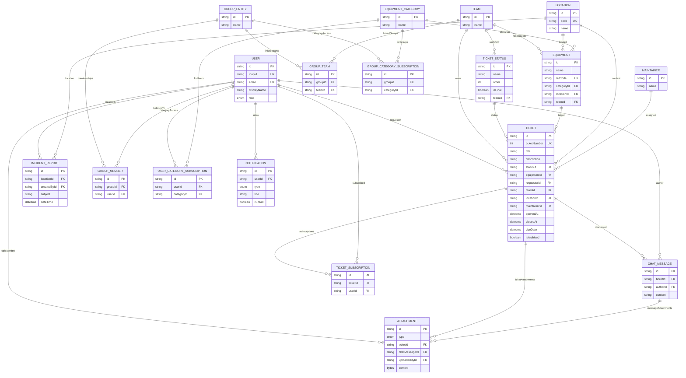

# Schema BDD (ERD)

Base de reference: `app/prisma/schema.prisma`.

## Entites principales

- `User`
- `Team`
- `TicketStatus`
- `Ticket`
- `Location`
- `EquipmentCategory`
- `Equipment`
- `Group` + tables de liaison (`GroupMember`, `GroupTeam`)
- `TicketSubscription`
- `Attachment`
- `ChatMessage`
- `Maintainer`
- `IncidentReport`
- `Notification`
- Abonnements categories (`GroupCategorySubscription`, `UserCategorySubscription`)

## ERD

